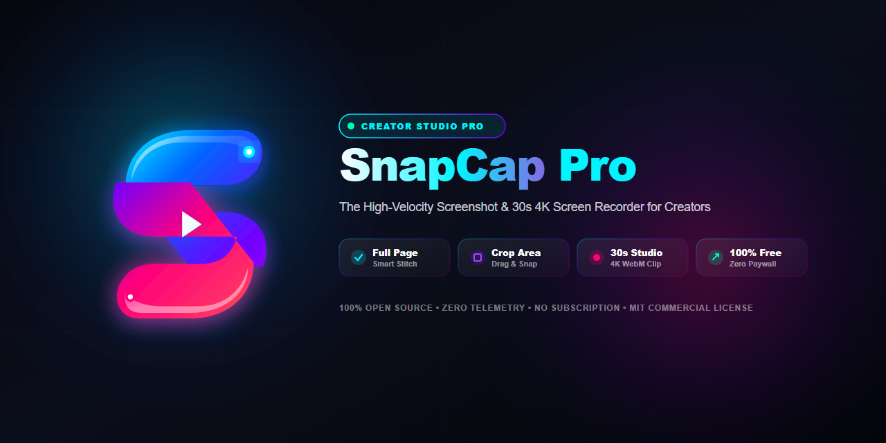
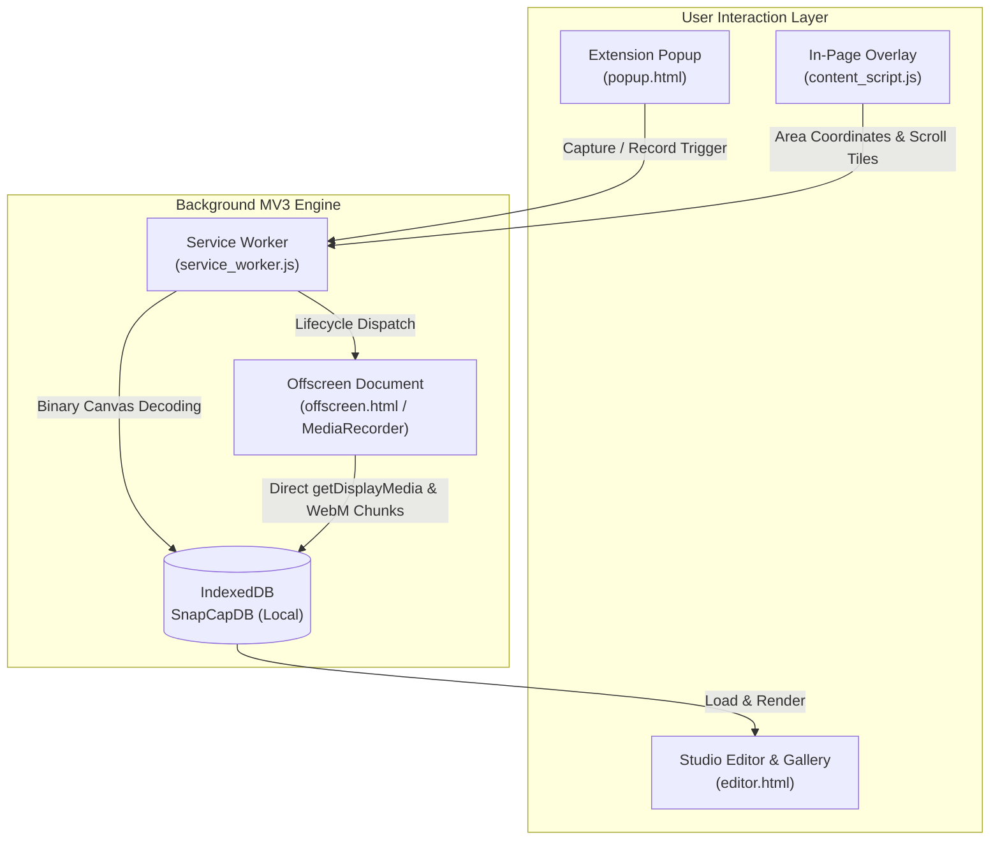

<div align="center">

  

# ⚡ SnapCap Pro

### The High-Velocity Screen Studio & 4K Recorder for Creators & Builders

[](manifest.json)
[](LICENSE)
[](https://ko-fi.com/oaichu)
[-7000FF?style=for-the-badge&logo=javascript&logoColor=white>)](package.json)
[](#-privacy--local-first-guarantee)
[](#-quick-start--installation)

  <br/>

[⚡ Why SnapCap Pro?](#-why-snapcap-pro) • [🌟 Core Features](#-core-features) • [🚀 Quick Start](#-quick-start--installation) • [🎨 Studio Suite](#-pro-studio-suite) • [🗄️ History Manager](#️-smart-history--storage-manager) • [🏗️ Architecture](#️-architecture) • [🛡️ Privacy](#-privacy--local-first-guarantee) • [📄 Commercial License](#-license--commercial-use)

</div>

---

## ⚡ Why SnapCap Pro?

Most screen capture and recording extensions on the Web Store today are **bloated (25MB–80MB)**, closed-source, bundle background trackers, or hold essential features like full-page scrolling, annotations, and video exports hostage behind expensive monthly subscriptions ($15–$30/mo).

**SnapCap Pro** is engineered from the ground up to give creators, developers, designers, and founders a **lightning-fast, zero-bloat, 100% free and open-source screen capture & recording powerhouse**:

- 🚀 **High Velocity**: 1-click visible snapshot, drag-and-snap crop, and automatic full-page stitching.
- 🎥 **Fluid 4K/60fps Recording**: Instant video clips with system audio & mic mixing without watermarks.
- 🎨 **Pro Studio Annotation**: Arrows, shapes, typography, and 1-click privacy redaction blur.
- 🗄️ **Smart Local Storage Manager**: Local IndexedDB gallery with individual item deletion, instant clipboard copy, and 1-click cache purge.
- 🔒 **100% Offline & Private**: Zero telemetry, zero external tracking, zero server lock-in.

---

## 🌟 Core Features

<table>
  <tr>
    <td width="50%" valign="top">
      <h3>📸 1. Pixel-Precision Screenshots</h3>
      <ul>
        <li><b>Visible Viewport</b>: Instant 1-click full-resolution snapshot.</li>
        <li><b>Selected Area Crop</b>: Drag-to-select region with live dimension HUD and sub-pixel clamping.</li>
        <li><b>Full Page Stitcher</b>: Auto-scroll engine with sticky header suppression & GPU texture guard.</li>
        <li><b>Countdown Timer</b>: 3s / 5s delay timer for capturing dropdown menus, tooltips, and hover states.</li>
      </ul>
    </td>
    <td width="50%" valign="top">
      <h3>🎥 2. Fluid Screen & Audio Recorder</h3>
      <ul>
        <li><b>High-FPS Capture</b>: Perfect for bug reports, video demos, tutorials, and async communication.</li>
        <li><b>System & Mic Audio Mixing</b>: Dual-channel audio mixer powered by native <code>AudioContext</code>.</li>
        <li><b>Direct DisplayMedia Engine</b>: Persistent background recorder that never fails when popups close.</li>
        <li><b>Frame Extractor</b>: Extract any instant video frame directly into the Studio Editor.</li>
      </ul>
    </td>
  </tr>
  <tr>
    <td width="50%" valign="top">
      <h3>🎨 3. Pro Studio Annotation Suite</h3>
      <ul>
        <li><b>Drawing Tools</b>: Freehand Pencil, Dynamic Precision Arrow (<code>↗️</code>), Rectangles, Circles.</li>
        <li><b>Smart Privacy Blur (<code>🌫️</code>)</b>: 1-drag pixelation for passwords, tokens, API keys, and PII.</li>
        <li><b>Typography Engine</b>: Crisp text overlays with dynamic contrast backing.</li>
        <li><b>20-Level Undo/Redo</b>: Non-destructive canvas history buffer.</li>
        <li><b>Direct Clipboard Integration</b>: 1-click copy directly into Slack, Figma, Zalo, Discord, or Notion.</li>
      </ul>
    </td>
    <td width="50%" valign="top">
      <h3>🗄️ 4. Local Storage & History Manager</h3>
      <ul>
        <li><b>Visual Gallery</b>: Browse all past screenshots and video recordings in a unified grid.</li>
        <li><b>Granular Deletion</b>: Delete individual captures with 1 click to reclaim local disk space.</li>
        <li><b>Direct Item Copy</b>: Copy images to clipboard or trigger instant downloads.</li>
        <li><b>Storage Estimator & Purge</b>: Real-time MB usage counter with a 1-click "Clear All History" feature.</li>
        <li><b>100% Local IndexedDB</b>: Your data never leaves your browser unless you choose to export it.</li>
      </ul>
    </td>
  </tr>
</table>

---

## 🚀 Quick Start & Installation

### Option A: Install from Release Package (Recommended)

1. Download [`snapcap-pro-v1.1.0-chrome-webstore.zip`](release/snapcap-pro-v1.1.0-chrome-webstore.zip) from the repository.
2. Unzip the file to a local folder (e.g. `SnapCap-Pro-Dist`).
3. Open Google Chrome (or Edge, Brave, Opera, Arc) and navigate to `chrome://extensions`.
4. Enable **Developer mode** (toggle in the top-right corner).
5. Click **Load unpacked** and select the unzipped folder.
6. Pin **SnapCap Pro** to your browser toolbar!

### Option B: Build from Source

```bash
# 1. Clone the repository
git clone https://github.com/oaichu/Snapcap-Pro.git
cd Snapcap-Pro

# 2. Install dev dependencies
npm install

# 3. Run full verification test suite
npm run test:all

# 4. Build production bundle & Chrome Web Store package
npm run release
```

The ready-to-upload ZIP package will be generated at `release/snapcap-pro-v1.1.0-chrome-webstore.zip`.

---

## 🎨 Pro Studio Suite

SnapCap Pro includes a complete built-in graphic editor designed specifically for creating high-impact visual explanations:

| Tool                  |      Shortcut       | Description                                                         |
| :-------------------- | :-----------------: | :------------------------------------------------------------------ |
| **Pencil**            |         `P`         | Freehand smooth vector drawing with adjustable stroke width.        |
| **Arrow**             |         `A`         | Intelligent dynamic pointer with arrowhead geometry.                |
| **Rectangle**         |         `R`         | Wireframe and boundary highlighting boxes.                          |
| **Circle**            |         `C`         | Optical focus rings for drawing attention to UI elements.           |
| **Text**              |         `T`         | Formatted multi-line text labels with high-contrast backing.        |
| **Privacy Blur**      |         `B`         | Non-reversible Gaussian redaction for credentials & sensitive info. |
| **Undo / Redo**       | `Ctrl+Z` / `Ctrl+Y` | Step backwards and forwards through 20 editing states.              |
| **Copy to Clipboard** |      `Ctrl+C`       | Instant raw PNG buffer write to system clipboard.                   |
| **Download**          |      `Ctrl+S`       | Export high-resolution PNG or WebM video.                           |

---

## 🗄️ Smart History & Storage Manager

SnapCap Pro stores all captures locally inside your browser's sandboxed **`SnapCapDB` (IndexedDB)**:

```
┌────────────────────────────────────────────────────────────────────────┐
│  My Captures                          14 items stored locally (~4.2 MB)│
│  [🗑️ Clear All History]                                                │
├────────────────────────────────────────────────────────────────────────┤
│  ┌──────────────────┐  ┌──────────────────┐  ┌──────────────────┐      │
│  │ 📸 Image         │  │ 🎥 Video (10s)   │  │ 📸 Full Page     │      │
│  │ [Edit][📋][⬇️][🗑️]│  │ [Play][📋][⬇️][🗑️]│  │ [Edit][📋][⬇️][🗑️]│      │
│  │ Aug 23, 03:00 PM │  │ Aug 23, 03:02 PM │  │ Aug 23, 03:05 PM │      │
│  └──────────────────┘  └──────────────────┘  └──────────────────┘      │
└────────────────────────────────────────────────────────────────────────┘
```

- **Zero Cloud Lock-in**: Everything works 100% offline without requiring logins or account creation.
- **Instant Disk Freedom**: Reclaim storage anytime by deleting individual items or clearing all history.

---

## 🏗️ Architecture

SnapCap Pro is built following Google's official **Manifest V3** best practices:



---

## 🛡️ Privacy & Local-First Guarantee

- 🟢 **No Tracking / No Telemetry**: SnapCap Pro contains zero Google Analytics, zero Mixpanel, zero Sentry, and zero ad scripts.
- 🟢 **No Remote Code Execution**: Full compliance with Chrome Web Store strict Content Security Policy (`script-src 'self'`).
- 🟢 **No Mandatory Cloud**: Captures remain strictly inside your browser's local sandbox.

---

## 📊 Comparison Matrix

| Feature                    | SnapCap Pro (Free)  |     Loom Free      | Awesome Screenshot |   Lightshot    |
| :------------------------- | :-----------------: | :----------------: | :----------------: | :------------: |
| **Open Source (MIT)**      |     ✅ **100%**     |     ❌ Closed      |     ❌ Closed      |   ❌ Closed    |
| **Price / Paywall**        | 💎 **Free Forever** |  $12.50/mo limit   |   $6/mo paywall    |  Ad-supported  |
| **Full Page Scrolling**    |  ✅ **Unlimited**   |       ❌ N/A       |    ⚠️ 3 free/mo    |     ❌ N/A     |
| **Recording Limit**        | ✅ **Configurable** | ⚠️ 5 min / 25 vids |    ⚠️ 5 min max    |     ❌ N/A     |
| **Privacy Redaction Blur** |   ✅ **Included**   |       ❌ N/A       |    🔒 Paid only    |     ❌ N/A     |
| **Local Offline Storage**  |  ✅ **100% Local**  |   ❌ Cloud only    |     ⚠️ Hybrid      | ❌ Public URLs |
| **Extension Size**         |   ⚡ **~188 KB**    |     ❌ ~45 MB      |     ❌ ~28 MB      |   ❌ ~12 MB    |

---

## 💖 Support & Buy Me a Coffee

SnapCap Pro is **100% free and open-source forever**, with zero paywalls, zero locked features, and zero tracking.

If SnapCap Pro speeds up your daily workflow, helps your content creation, or provides value to your team, please consider supporting ongoing maintenance and new features by buying me a coffee:

<div align="center">

  <a href="https://ko-fi.com/oaichu" target="_blank" rel="noopener noreferrer">
    
  </a>

<br/><br/>

<i>Every cup of coffee fuels continuous development, new features, and community support. Thank you for your generosity! ☕✨</i>

</div>

---

## 📄 License & Commercial Use

SnapCap Pro is distributed under the **[MIT License](LICENSE)**.

- ✅ **Commercial Use Permitted**: You are free to use, modify, package, distribute, and monetize SnapCap Pro in personal and commercial environments with zero licensing fees.
- ✅ **Attribution**: Simply retain the original copyright notice in source distributions.

---

<div align="center">
  <b>Built with passion for creators, engineers, and designers worldwide.</b><br/>
  ⭐ Star this repo if you find it helpful!
</div>
